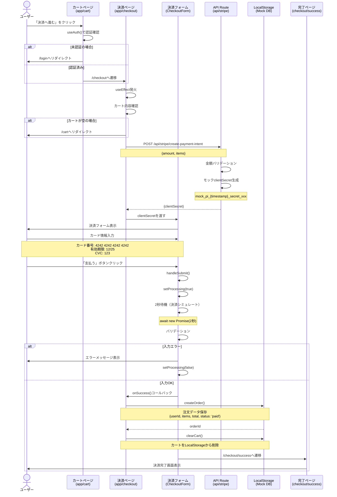

# 決済処理シーケンス図

## モックモード決済フロー



## 主要な処理フロー

### 1. 認証チェック
```typescript
if (!user) {
  router.push('/login');
  return;
}
```

### 2. カート確認
```typescript
if (items.length === 0) {
  router.push('/cart');
  return;
}
```

### 3. Payment Intent作成
```typescript
const response = await fetch('/api/stripe/create-payment-intent', {
  method: 'POST',
  body: JSON.stringify({ amount: totalPrice, items: orderItems })
});
```

### 4. モック決済処理
```typescript
// 2秒待機でシミュレート
await new Promise((resolve) => setTimeout(resolve, 2000));

// バリデーション
if (!cardNumber || !expiry || !cvc) {
  throw new Error('全てのフィールドを入力してください');
}

// 成功
onSuccess();
```

### 5. 注文保存とカートクリア
```typescript
// 注文保存
await createOrder({
  userId: user.uid,
  items: items.map(item => ({
    productId: item.product.id,
    productName: item.product.name,
    price: item.product.price,
    quantity: item.quantity
  })),
  total: totalPrice,
  status: 'paid'
});

// カートクリア
clearCart();
```

## データフロー

```
CartContext (items, totalPrice)
    ↓
CheckoutPage
    ↓
API Route (clientSecret生成)
    ↓
CheckoutForm (ユーザー入力)
    ↓
決済処理 (2秒待機)
    ↓
handleSuccess()
    ├─ createOrder() → LocalStorage
    └─ clearCart() → LocalStorage
    ↓
Success Page
```

## エラーハンドリング

| エラーケース | 処理 |
|------------|------|
| 未認証 | /loginへリダイレクト |
| カート空 | /cartへリダイレクト |
| Payment Intent失敗 | エラーメッセージ表示 |
| バリデーション失敗 | フォームにエラー表示 |
| 注文保存失敗 | コンソールエラー出力 |

## LocalStorageデータ構造

### 注文データ (mock_orders)
```json
[
  {
    "id": "order_1234567890",
    "userId": "mock_user@example.com",
    "items": [
      {
        "productId": "1",
        "productName": "ワイヤレスイヤホン",
        "price": 8900,
        "quantity": 2
      }
    ],
    "total": 17800,
    "status": "paid",
    "createdAt": "2024-01-01T00:00:00.000Z",
    "updatedAt": "2024-01-01T00:00:00.000Z"
  }
]
```

### カートデータ (shopping-cart)
```json
[
  {
    "product": {
      "id": "1",
      "name": "ワイヤレスイヤホン",
      "price": 8900,
      "description": "...",
      "imageUrl": "...",
      "stock": 50,
      "category": "電子機器"
    },
    "quantity": 2
  }
]
```

## モックモードの特徴

✅ **実際の決済なし**: Stripeを呼び出さない  
✅ **即座に完了**: 2秒で決済シミュレート  
✅ **LocalStorage保存**: 注文データは永続化  
✅ **リロード可能**: データは保持される  
✅ **開発向け**: 外部サービス設定不要

## 本番環境への移行

本番環境では以下の変更が必要：

### 1. Stripe実装
- `@stripe/react-stripe-js`の`PaymentElement`使用
- 実際のStripe API呼び出し
- Webhookで決済完了を検知

### 2. 在庫管理
- 決済前に在庫確認
- 決済成功時に在庫減算
- 在庫不足時のエラーハンドリング

### 3. トランザクション処理
- 在庫減算と注文保存をアトミックに実行
- ロールバック処理の実装
- 二重決済の防止

### 4. セキュリティ
- CSRF対策
- 金額改ざん防止
- サーバーサイドでの金額再計算

## ファイル構成

| ファイル | 役割 |
|---------|------|
| `app/checkout/page.tsx` | 決済ページメイン |
| `components/checkout/CheckoutForm.tsx` | 決済フォーム |
| `app/api/stripe/create-payment-intent/route.ts` | Payment Intent API |
| `lib/mock/firestore.ts` | モックDB操作 |
| `contexts/CartContext.tsx` | カート状態管理 |

## 処理時間

| 処理 | 時間 |
|------|------|
| Payment Intent作成 | 500ms |
| 決済処理 | 2000ms |
| 注文保存 | 300ms |
| カートクリア | 即座 |
| **合計** | **約2.8秒** |

---

**注意**: このシーケンス図はモックモードの動作を示しています。本番環境では実際のStripe APIとFirebaseを使用する必要があります。

